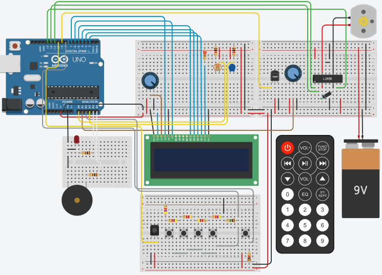
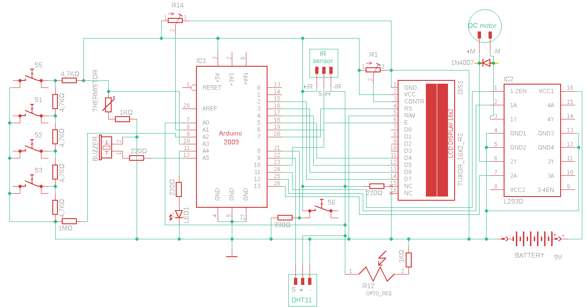
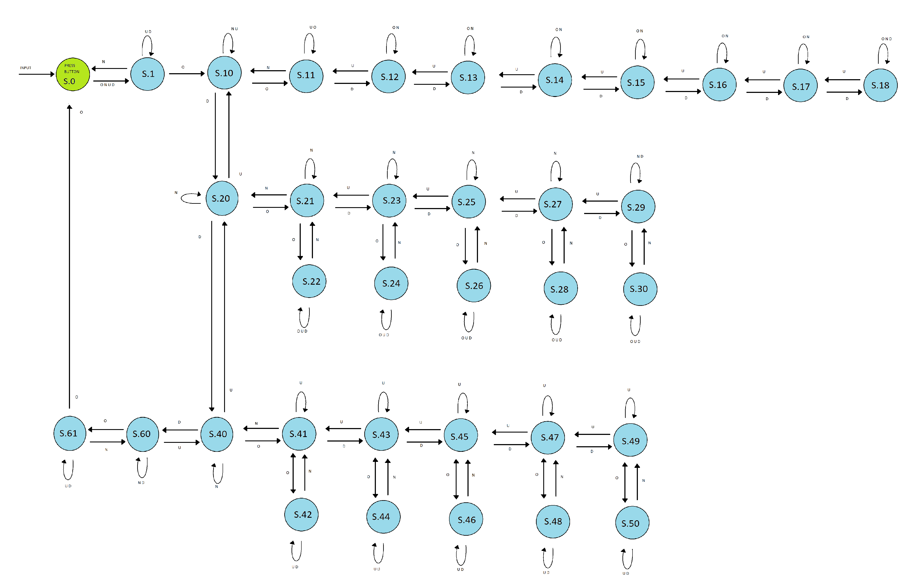
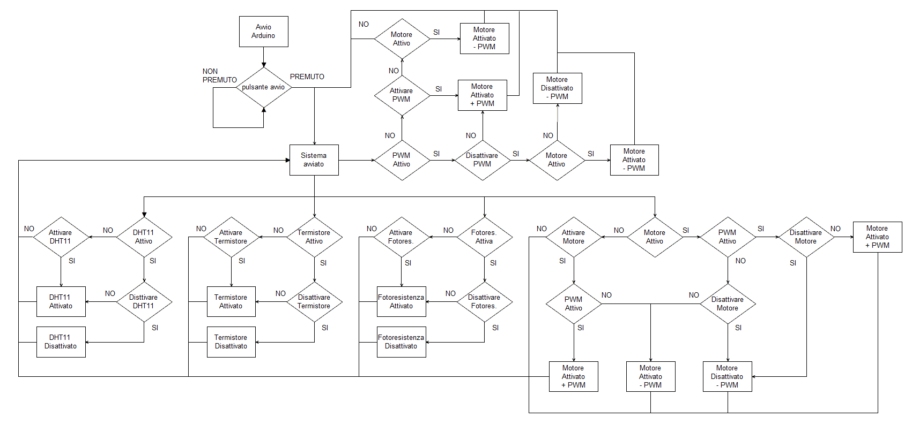
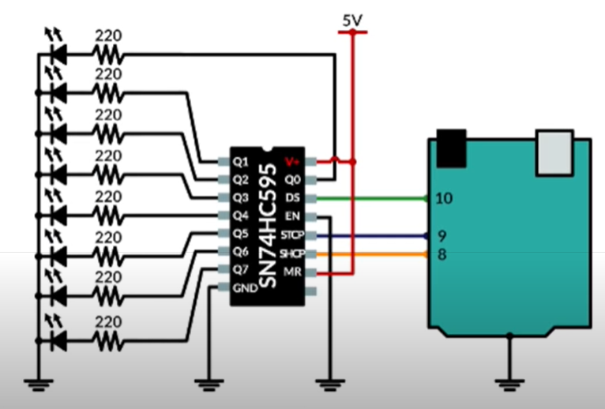
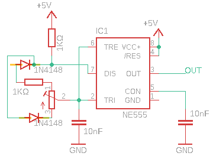

- [High-school-graduation-project](#high-school-graduation-project)
  - [Nucleo del progetto](#nucleo-del-progetto)
  - [Schemi](#schemi)
    - [Sbrogliato finale](#sbrogliato-finale)
    - [Schema elettrico finale](#schema-elettrico-finale)
    - [Diagramma degli stati](#diagramma-degli-stati)
    - [Diagramma di flusso completo](#diagramma-di-flusso-completo)
    - [Integrazioni](#integrazioni)
      - [Sbrogliato: shift register](#sbrogliato-shift-register)
      - [Schema elettrico: NE555 in PWM](#schema-elettrico-ne555-in-pwm)

# High-school-graduation-project

## Nucleo del progetto

Il progetto portato all'esame di maturità consisteva in un prototipo di una centralina per il controllo di un motore DC con l'aggiunta di eventuali modifiche e integrazioni.
Per ulteriori approfondimenti consiglio di visionare i vari PDF, uno dei quali contiene dei link, oramai non più funzionanti, di immagini e schemi ma presenti (e raggiungibili) nelle varie cartelle.

## Schemi

### Sbrogliato finale

### Schema elettrico finale

### Diagramma degli stati

### Diagramma di flusso completo

### Integrazioni

#### Sbrogliato: shift register

#### Schema elettrico: NE555 in PWM

